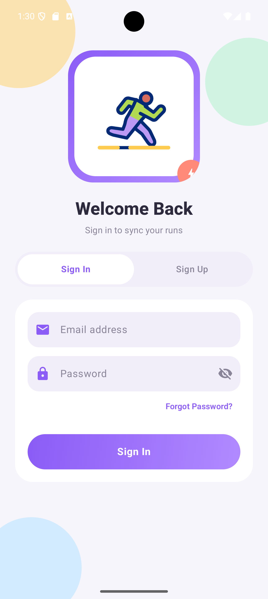
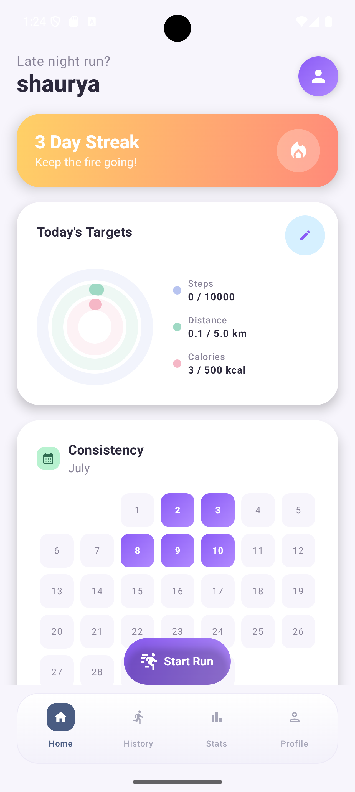
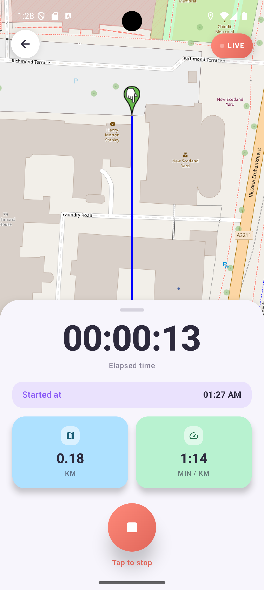
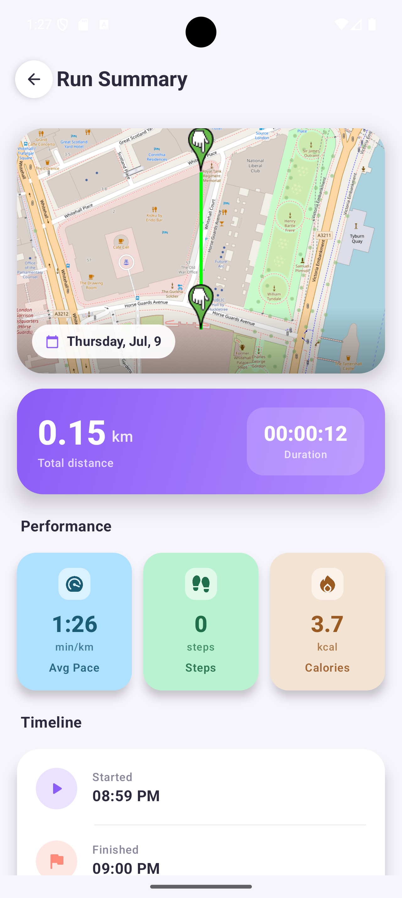
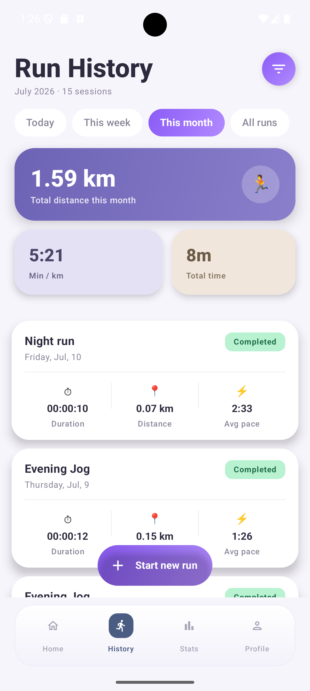
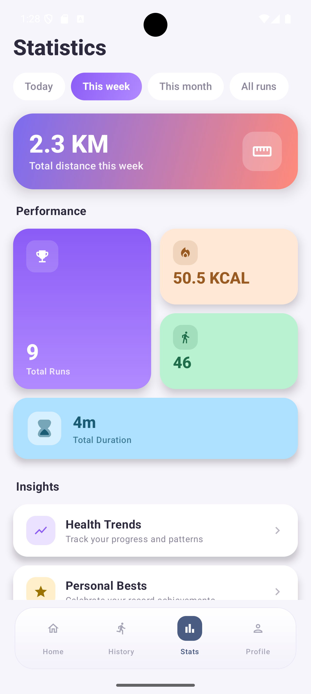
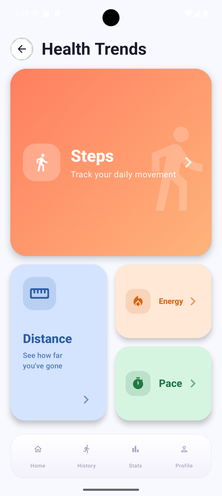
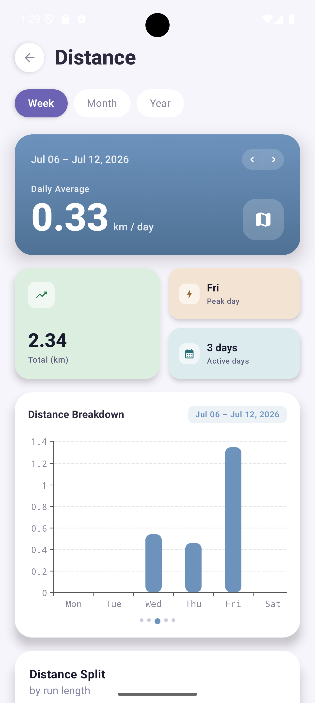
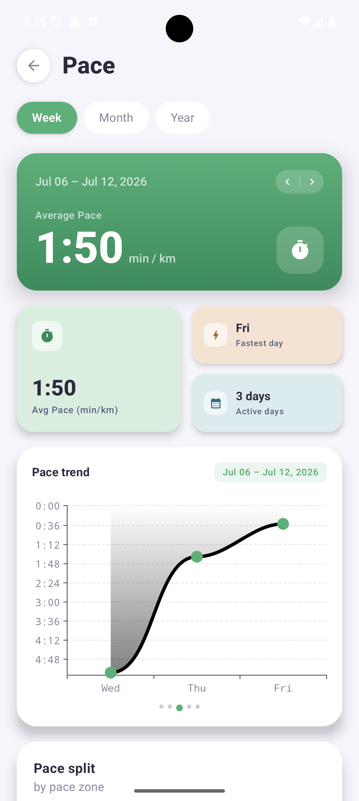
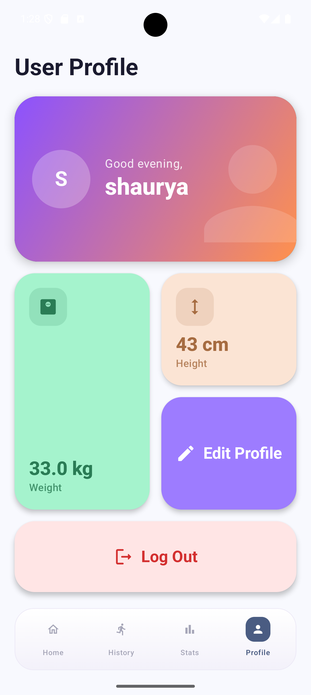

<div align="center">

# FitBuddy

### An offline-first run tracking app for Android, engineered like production software.

Kotlin · Jetpack Compose · Clean Architecture · MVVM · Room · Firestore · OSMDroid

<p>
<a href="https://kotlinlang.org"></a>
<a href="https://developer.android.com/jetpack/compose"></a>
<a href="#"></a>
<a href="https://github.com/Shaurya-codesx/Fitness-Tracker/actions/workflows/android.yml"></a>
<a href="#-license"></a>
</p>

**[⬇ Download APK](https://github.com/Shaurya-codesx/Fitness-Tracker/releases/tag/v1.0.0)** &nbsp;·&nbsp; **[📂 View Source](https://github.com/Shaurya-codesx/Fitness-Tracker)** &nbsp;·&nbsp; **[🐛 Report Bug](https://github.com/Shaurya-codesx/Fitness-Tracker/issues)**

</div>

<br/>

## 🎥 Demo

<div align="center">


## 📱 App Demo video

[](https://youtu.be/Dto2yKJGeVM)


</div>

<br/>

## 📸 Screenshots

<div align="center">
<table>
<tr>
<td align="center" width="33%"><br/><sub><b>Authentication</b></sub></td>
<td align="center" width="33%"><br/><sub><b>Home — Streaks & Consistency</b></sub></td>
<td align="center" width="33%"><br/><sub><b>Live Run Tracking</b></sub></td>
</tr>
<tr>
<td align="center" width="33%"><br/><sub><b>Run Summary & Route Map</b></sub></td>
<td align="center" width="33%"><br/><sub><b>Run History</b></sub></td>
<td align="center" width="33%"><br/><sub><b>Statistics Overview</b></sub></td>
</tr>
<tr>
<td align="center" width="33%"><br/><sub><b>Health Trends Hub</b></sub></td>
<td align="center" width="33%"><br/><sub><b>Distance Analytics</b></sub></td>
<td align="center" width="33%"><br/><sub><b>Pace Analytics</b></sub></td>
</tr>
<tr>
<td align="center" width="33%"><br/><sub><b>User Profile</b></sub></td>
<td colspan="2"></td>
</tr>
</table>
</div>

<br/>

## 📖 Table of Contents

- [About](#-about-the-project)
- [Features](#-features)
- [Tech Stack](#-tech-stack)
- [Architecture](#-architecture)
- [Project Structure](#project-structure)
- [Getting Started](#-getting-started)
- [Testing](#-testing)
- [Roadmap](#-roadmap)
- [Contributing](#-contributing)
- [License](#-license)

<br/>

## 💡 About The Project

**FitBuddy** is a full-featured Android running-tracker built to demonstrate what production-grade mobile engineering looks like — not just another CRUD app with a map screen bolted on.

It combines **live GPS tracking**, an **offline-first sync pipeline**, **battery-aware background work**, and **deep, filterable analytics** into a single cohesive app with a handcrafted design system. Every layer — data, domain, and UI — is deliberately separated, unit-tested, and wired through dependency injection, the way a team shipping this at scale would build it.

**Why this project stands out:**

- 🧭 **Real-time GPS tracking** via a persistent foreground service that survives backgrounding and app kills — auto-pausing on GPS loss and resuming the moment location returns.
- 📴 **Offline-first architecture** — Room is the single source of truth; Firestore sync runs silently in the background, only when the device is idle and battery isn't low, with automatic retry on failure.
- 📊 **Deep analytics engine** — four independently filterable analytics screens (Distance, Pace, Steps, Energy) with custom Compose-native bar/line charts, donut zone-splits, and swipe-to-navigate historical periods.
- 🧱 **Clean Architecture + MVVM** with a genuine `Domain` layer of use cases, repository interfaces, and DI-driven boundaries.
- 🧪 **Tested business logic** — unit tests (JUnit + MockK + Turbine) for ViewModels, use cases, and DAOs, gated by a working GitHub Actions CI pipeline on every push.
- 🎨 **Handcrafted design system** — a pastel Material You aesthetic with bento-style asymmetric layouts and zero hardcoded strings.

<br/>

## ✨ Features

### 🔐 Authentication
- Firebase Authentication (email/password) with a **forgot password** flow
- Full success / loading / error / empty state handling on every auth screen

### 📍 Live Run Tracking
- Real-time GPS tracking via **FusedLocationProviderClient** with high accuracy
- Live polyline route drawing on an interactive **OSMDroid** map
- Live elapsed time, distance, and pace updates during a run
- **Foreground Service** with a dynamic, persistent notification showing live distance and time
- Automatic **run pause** on GPS/location loss with an in-notification error prompt, and automatic **resume** the instant location is restored
- Step counting via the device's built-in step sensor

### 🗺️ Run History & Details
- Full run history filterable by **Today / Week / Month / All**
- Per-run detail screen: distance, calories, steps, average pace, duration, and a **pinch-to-zoom interactive map** with the exact route drawn

### 📊 Statistics & Health Trends
- Aggregate stats (steps, distance, calories, time, session count) across selectable time ranges
- Four dedicated deep-analytics screens — **Distance, Pace, Steps, Energy** — each with:
    - Bar/line graphs bucketed by day (week view), week (month view), or month (year view)
    - **Swipe navigation** to browse previous periods
    - A companion **donut chart** breaking data into effort zones
- **Personal Bests** dashboard — longest distance, fastest pace, most steps, most calories, all-time

### 🏠 Home Dashboard
- **GitHub-style consistency heatmap** visualizing workout streaks for the current month
- Live streak counter with retention-focused messaging
- Editable daily targets via a bottom sheet — persisted locally via **DataStore**, resetting automatically each day

### 👤 Profile & Onboarding
- Editable user profile (name, weight, height) with logout
- Feature-walkthrough onboarding flow with **graceful, crash-free permission handling** for notifications, location, and physical activity — with rationale dialogs when permissions are denied

### 🔔 Smart Notifications
- Streak-preservation nudges (~6 PM) when a 3+ day streak is about to break
- Re-engagement nudges after 3 days of inactivity
- No spam — notification logic is deliberately conservative

### ☁️ Offline-First Sync
- **Room** database as the single source of truth for all app data
- Background sync to **Firestore** via **WorkManager**, only when the device is idle and **battery-aware** (skips sync on low battery)
- Automatic retry on network/connectivity failure

### 🧪 Quality & Tooling
- Unit tests with **JUnit + MockK + Turbine** covering ViewModels, use cases, and DAO operations
- Instrumented Room DAO tests
- **CI/CD pipeline** (GitHub Actions) running the full test suite and a debug build on every push/PR

<br/>

## 🛠️ Tech Stack

| Layer                 | Technology                                                        |
|-----------------------|-------------------------------------------------------------------|
| **Language**          | Kotlin 2.0.21                                                     |
| **UI**                | Jetpack Compose (BOM 2024.09), Material 3                         |
| **Architecture**      | Clean Architecture · MVVM · Unidirectional Data Flow (StateFlow)  |
| **DI**                | Hilt                                                              |
| **Local Persistence** | Room, DataStore Preferences                                       |
| **Remote / Auth**     | Firebase Authentication, Cloud Firestore, Firebase Messaging      |
| **Location**          | FusedLocationProviderClient, Android Foreground Services          |
| **Maps**              | OSMDroid (interactive polyline route rendering)                   |
| **Background Work**   | WorkManager (battery-aware sync, notification scheduling)         |
| **Charts**            | Vico (Compose-native bar/line charts), custom Canvas donut charts |
| **Image Loading**     | Coil (with GIF support via `coil-gif`)                            |
| **Async**             | Kotlin Coroutines & Flow                                          |
| **Testing**           | JUnit4, MockK, Turbine, Room Testing, Espresso                    |
| **CI/CD**             | GitHub Actions                                                    |
| **Build**             | Gradle Kotlin DSL, KSP                                            |

<br/>

## 🏗️ Architecture

FitBuddy follows **Clean Architecture** with a strict separation between UI, domain logic, and data — each layer depending only inward, never outward.

```
┌─────────────────────────────────────────────┐
│                    UI Layer                  │
│   Jetpack Compose Screens + ViewModels       │
│   (StateFlow-driven UI state, one per screen)│
└───────────────────┬───────────────────────────┘
                     │ depends on
┌───────────────────▼───────────────────────────┐
│                 Domain Layer                  │
│  Repository Interfaces · Use Cases            │
│  (CalculateCalories, PaceSplit, DistanceSplit,│
│   EnergySplit, DateRange, PaceFormatter, ...) │
└───────────────────┬───────────────────────────┘
                     │ implemented by
┌───────────────────▼───────────────────────────┐
│                  Data Layer                   │
│  Room (DAO/Entities) · Firestore Sync Worker  │
│  Location Provider · Foreground Service       │
│  Step Counter · Repository Implementations    │
└─────────────────────────────────────────────┘
```

**Key design decisions:**
- Each analytics domain (Distance, Pace, Steps, Energy) has its own `UiState`, `GraphHelper`, and `Screen`, keeping feature slices isolated and independently testable.
- All business logic (calorie calculation, pace formatting, date-range resolution, zone splitting) lives in single-responsibility **Use Cases** under `Domain/UseCases`, decoupled from ViewModels and fully unit-testable.
- `Resource<T>` sealed wrapper standardizes Success/Loading/Error states across the entire data layer.
- Room is the **single source of truth**; `RunSyncWorker` reconciles unsynced records to Firestore in the background, respecting battery and connectivity state.

### Project Structure

```
app/src/main/java/com/example/fitnessapp/
├── Data/
│   ├── Location/          # FusedLocationProvider wrapper, location exceptions
│   ├── Model/              # Room entities, DAOs, AppDatabase, type converters
│   │   ├── Entities/
│   │   ├── StatsDataClasses/
│   │   └── Sync/           # WorkManager sync worker
│   ├── Repositories/       # Repository implementations
│   ├── Service/            # Foreground location service
│   └── StepCounter/        # Step sensor abstraction + implementation
├── Domain/
│   ├── Notifications/      # Streak reminder worker
│   ├── UseCases/           # Calorie, pace, distance, energy, date-range use cases
│   ├── Wrapper/             # Resource<T> sealed result wrapper
│   └── *Repository.kt       # Repository interfaces (contracts)
├── DI/                      # Hilt modules (App, Firebase, Database)
├── ui/
│   ├── Auth/                 # Login, AuthViewModel
│   ├── activity/
│   │   ├── HomeScreen/        # Heatmap, streaks, daily targets
│   │   ├── Onboarding/         # Permission-aware onboarding flow
│   │   ├── RunHistory/         # History list + RunDetails (map + stats)
│   │   ├── Stats/               # Overview + Personal Bests
│   │   │   ├── Distance/ Pace/ Steps/ Energy/   # Analytics screens
│   │   ├── Tracking/            # Live run session, OSM map, alerts
│   │   └── UserProfile/
│   ├── components/            # Shared composables (BottomBar, HealthTrends)
│   ├── theme/                  # Color tokens, typography, Material theme
│   └── UiStates/                # Screen-level UI state models
└── FitnessApplication.kt
```

<br/>

## 🚀 Getting Started

### Prerequisites
- Android Studio (latest stable)
- JDK 17
- A Firebase project with **Authentication**, **Firestore**, and **Cloud Messaging** enabled

### Installation

1. **Clone the repo**
   ```bash
   git clone https://github.com/Shaurya-codesx/Fitness-Tracker.git
   cd Fitness-Tracker
   ```

2. **Add your Firebase config**
   Download `google-services.json` from your Firebase console and place it in `app/`.

3. **Build & run**
   ```bash
   ./gradlew assembleDebug
   ```
   Or open the project in Android Studio and hit Run.

### 📥 Or just install it

Grab the latest signed APK from the [**Releases**](https://github.com/Shaurya-codesx/Fitness-Tracker/releases/tag/v1.0.0) page — no build setup required.

<br/>

## 🧪 Testing

```bash
# Run local unit tests (ViewModels, Use Cases)
./gradlew testDebugUnitTest

# Run instrumented tests (Room DAO, on a device/emulator)
./gradlew connectedAndroidTest
```

Every push and pull request against `main` automatically runs the full unit test suite and a debug build via **GitHub Actions** — see [`.github/workflows/android.yml`](.github/workflows/android.yml).

<br/>

## 🗺️ Roadmap

- [ ] Social features — follow friends, compare stats
- [ ] Route-based challenges & achievements
- [ ] Wear OS companion app
- [ ] Apple Health / Google Fit data import
- [ ] Dark theme

Have an idea? Open an [issue](https://github.com/Shaurya-codesx/Fitness-Tracker/issues) or a discussion.

<br/>

## 🤝 Contributing

Contributions are welcome. To contribute:

1. Fork the project
2. Create your feature branch (`git checkout -b feature/AmazingFeature`)
3. Commit your changes (`git commit -m 'Add some AmazingFeature'`)
4. Push to the branch (`git push origin feature/AmazingFeature`)
5. Open a Pull Request

<br/>

## 📄 License

Distributed under the MIT License. See `LICENSE` for more information.

<br/>

## 📬 Contact

**Shaurya** — [GitHub @Shaurya-codesx](https://github.com/Shaurya-codesx)

Project Link: [https://github.com/Shaurya-codesx/Fitness-Tracker](https://github.com/Shaurya-codesx/Fitness-Tracker)

<div align="center">

If you found this project interesting, consider giving it a ⭐ — it helps a lot!

</div>
